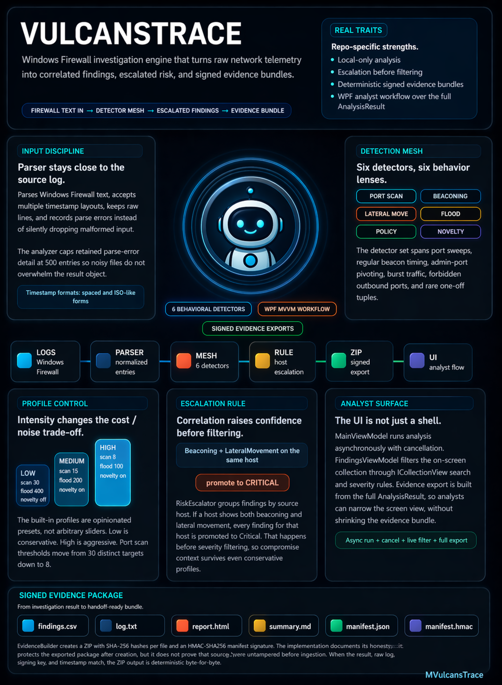

# VulcansTrace

VulcansTrace is a Windows desktop security analysis tool that parses Windows Firewall logs, runs multiple behavioral detectors, correlates related findings, and packages investigation results into signed evidence exports. **All analysis runs locally, logs never leave the machine.**



This repository is structured to be easy for both recruiters and technical reviewers to inspect:

- The code shows the production-facing implementation across parsing, detection, evidence packaging, testing, and WPF UI layers.
- [Official-Docs](./Official-Docs/README.md) contains recruiter-friendly and technical case studies for the main parts of the system.

## Why This Project Stands Out

- End-to-end ownership: raw firewall text goes in, structured findings and signed investigation artifacts come out.
- Security focus: the project centers on threat detection, forensic traceability, and honest handling of trade-offs and limitations.
- Strong engineering proof: the solution builds cleanly and the automated test suite covers parser, detector, evidence, and WPF workflows.
- Clear communication: the documentation is organized for both quick recruiter review and deeper engineering evaluation.

## Core Capabilities

- Windows Firewall log parsing with validation, raw-line preservation, and parse-error reporting
- Detection for port scans, beaconing, lateral movement, flood behavior, policy violations, and novelty
- Cross-signal risk escalation when findings align on the same host
- Intensity profiles that trade off completeness, cost, and analyst noise
- Evidence export in multiple formats with integrity support for investigator handoff
- WPF desktop UI with MVVM patterns, asynchronous analysis, filtering, and export workflow

## Architecture

- [VulcansTrace.Core](./VulcansTrace.Core): domain models, parsing, and shared security utilities
- [VulcansTrace.Engine](./VulcansTrace.Engine): detectors, risk escalation, profile configuration, and analysis orchestration
- [VulcansTrace.Evidence](./VulcansTrace.Evidence): evidence builder plus Markdown, HTML, and CSV formatters
- [VulcansTrace.Wpf](./VulcansTrace.Wpf): Windows desktop UI built with WPF and MVVM-style ViewModels
- [VulcansTrace.Tests](./VulcansTrace.Tests): xUnit coverage across core logic, engine behavior, evidence packaging, and UI workflows
- [Official-Docs](./Official-Docs/README.md): GitHub-facing portfolio documentation for the major subsystems

## Start Here

If you are reviewing this repo quickly, use this path:

1. Read [Official-Docs](./Official-Docs/README.md) for the portfolio index.
2. Open [Port Scan Detection](./Official-Docs/02-Port-Scan-Detection/README.md) for a representative detector case study.
3. Open [Risk Escalation](./Official-Docs/08-Risk-Escalation/README.md) to see how findings are correlated into higher-confidence host risk.
4. Open [Evidence Packaging](./Official-Docs/09-Evidence-Packaging/README.md) to see how results are turned into shareable signed artifacts.
5. Open [WPF UI](./Official-Docs/12-WPF-UI/README.md) to see how the product is surfaced in a desktop workflow.

## Running The Project

This repository targets `.NET 9` and the desktop application is Windows-only because it uses WPF.

```powershell
dotnet build VulcansTrace.sln
dotnet test VulcansTrace.Tests\VulcansTrace.Tests.csproj
dotnet run --project VulcansTrace.Wpf
```

## Technical Proof

- Solution entry point: [VulcansTrace.sln](./VulcansTrace.sln)
- Desktop app: [VulcansTrace.Wpf](./VulcansTrace.Wpf)
- Detection engine: [VulcansTrace.Engine](./VulcansTrace.Engine)
- Evidence packaging: [VulcansTrace.Evidence](./VulcansTrace.Evidence)
- Tests: [VulcansTrace.Tests](./VulcansTrace.Tests)

Recent validation in this workspace:

- `dotnet build VulcansTrace.sln` succeeded with `0` warnings and `0` errors on April 23, 2026.
- `dotnet test VulcansTrace.Tests\VulcansTrace.Tests.csproj --no-build` passed `222/222` tests on April 23, 2026.

## Live Demos

### Core Analysis Workflow

<video src="gifs/01_Core_analysis_gif.mp4" width="100%" autoplay loop muted playsinline></video>

### Intensity Profile Deep Dive

<video src="gifs/02_Intensity_deep_dive_gif.mp4" width="100%" autoplay loop muted playsinline></video>

### Evidence Export

<video src="gifs/03_Evidence_export_gif.mp4" width="100%" autoplay loop muted playsinline></video>

## Documentation Map

- [1 - Log Parsing](./Official-Docs/01-Log-Parsing/README.md)
- [2 - Port Scan Detection](./Official-Docs/02-Port-Scan-Detection/README.md)
- [3 - Beaconing Detection](./Official-Docs/03-Beaconing-Detection/README.md)
- [4 - Lateral Movement Detection](./Official-Docs/04-Lateral-Movement-Detection/README.md)
- [5 - Flood Detection](./Official-Docs/05-Flood-Detection/README.md)
- [6 - Policy Violation Detection](./Official-Docs/06-Policy-Violation-Detection/README.md)
- [7 - Novelty Detection](./Official-Docs/07-Novelty-Detection/README.md)
- [8 - Risk Escalation](./Official-Docs/08-Risk-Escalation/README.md)
- [9 - Evidence Packaging](./Official-Docs/09-Evidence-Packaging/README.md)
- [10 - Intensity Profiles](./Official-Docs/10-Intensity-Profiles/README.md)
- [11 - Automated Tests](./Official-Docs/11-Automated-Tests/README.md)
- [12 - WPF UI](./Official-Docs/12-WPF-UI/README.md)

## What Reviewers Should Expect

- Honest documentation that explains both strengths and current limitations
- A codebase organized by responsibility instead of a single monolith
- Tests that exercise detectors, integration paths, evidence formatting, and desktop workflows
- A portfolio presentation that stays grounded in the current implementation rather than inflated claims
